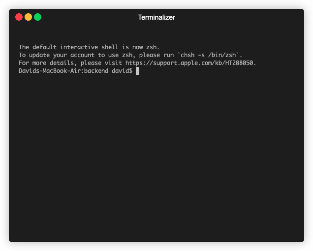

# herbs2repl
Herbs REPL



### Installing
    $ npm install herbs2repl

### Using

`srs/domain/usecases/_uclist.js`:
```javascript
module.exports = (injection) => {
    return [
        { usecase: require('./createItem').createItem(injection), tags: { group: 'Items' } },
        { usecase: require('./updateItem').updateItem(injection), tags: { group: 'Items' } },
        ...
     ]
}
```

`srs/infra/repl/index.js`:
```javascript
const usecases = require('../../domain/usecases/_uclist')
const repl = require('herbs2repl')

const main = async (injection) => {
    
    // list of all use cases, initialized
    const ucs = usecases(injection)

    // your user for the REPL session
    const user = {
        canAddItem: true, canCreateList: true, canDeteleList: false,
        canGetLists: true, canUpdateItem: true, canUpdateList: true
    }

    repl(ucs, user)
}

main().then()
```
